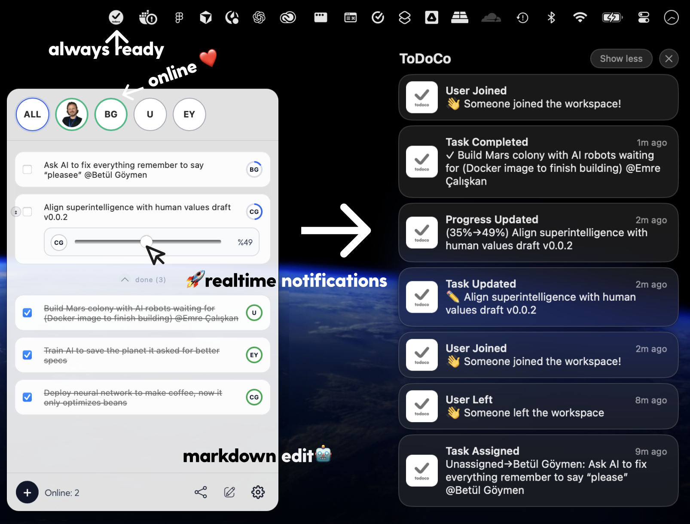
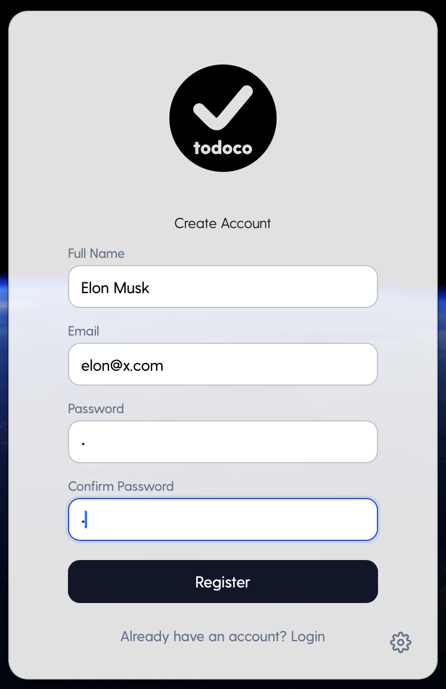
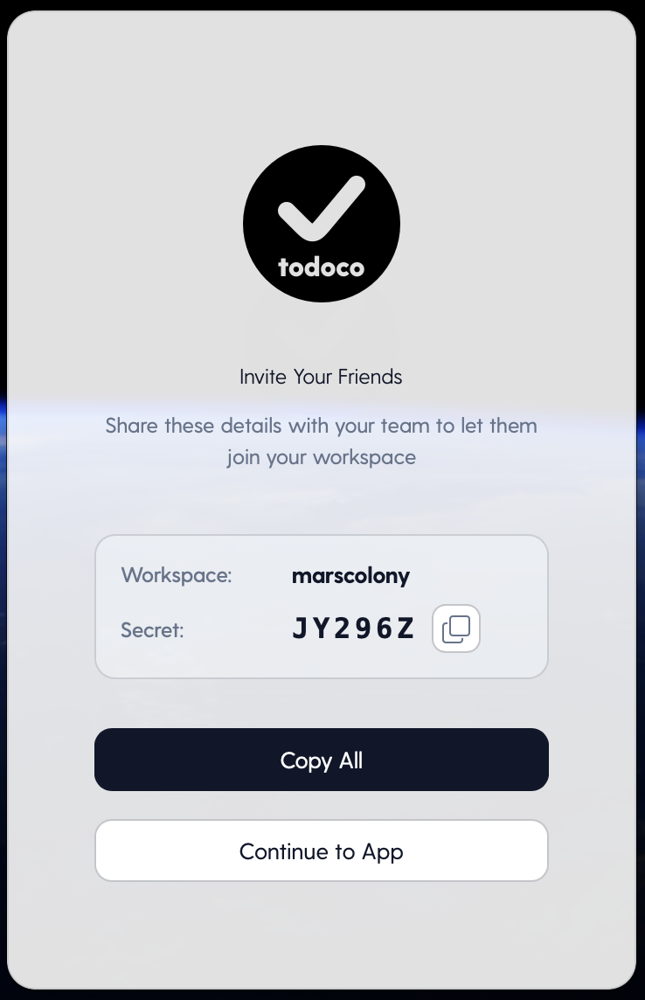
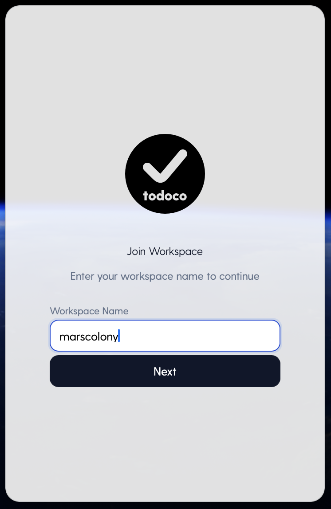
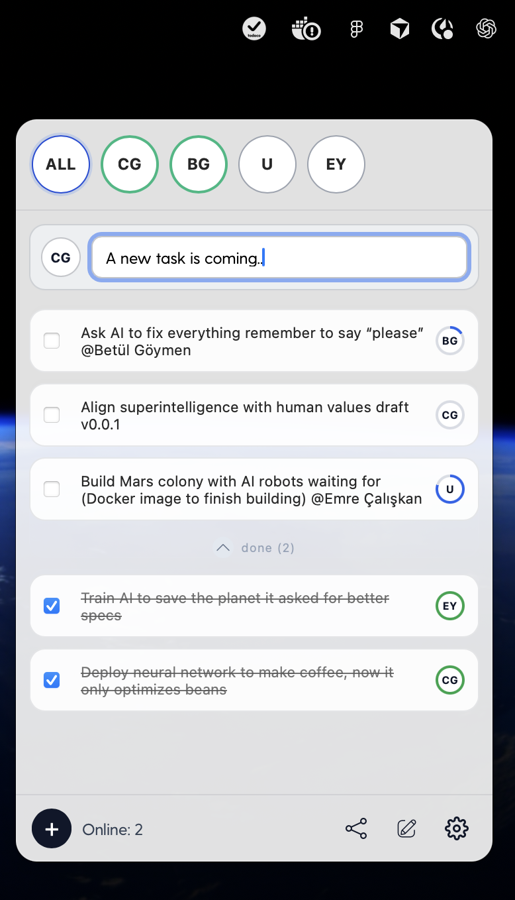
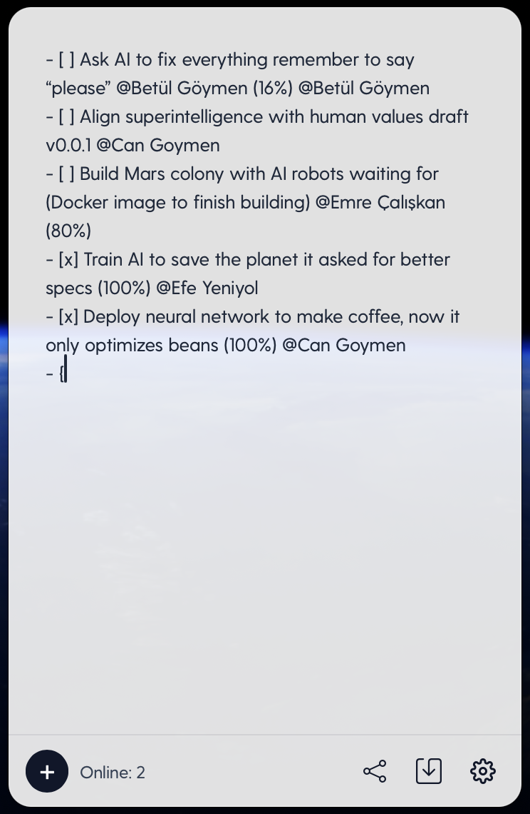
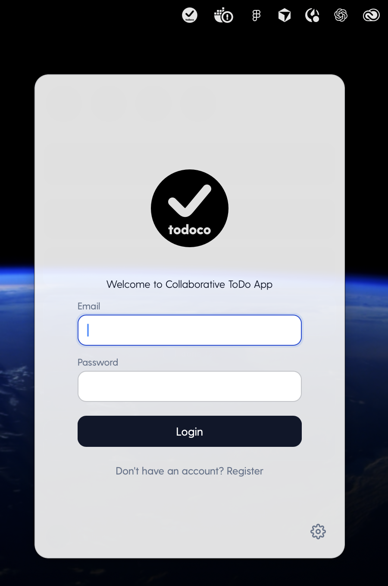
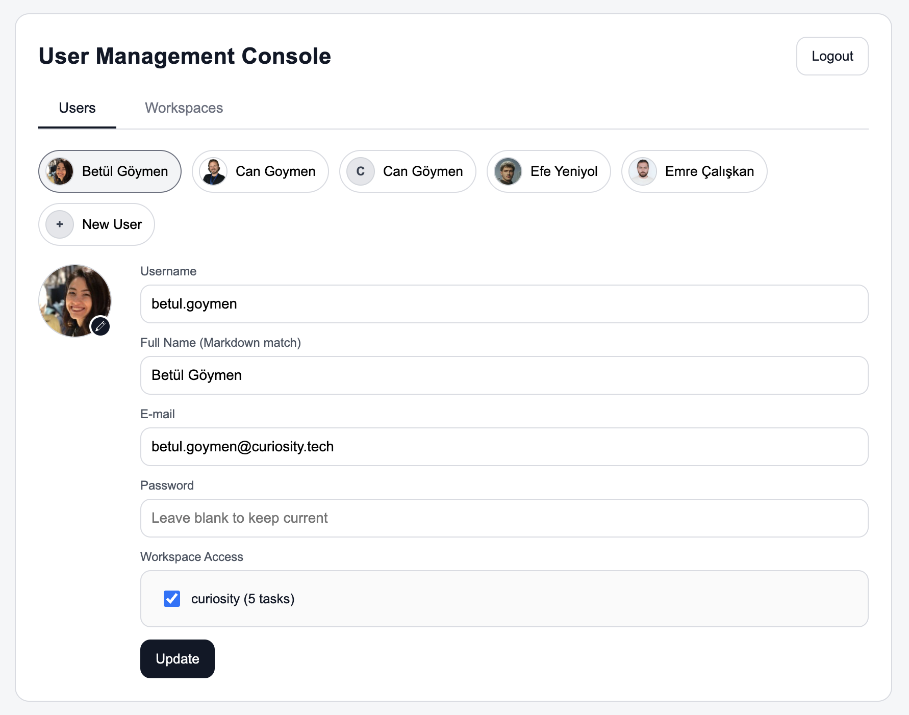

<h1 align="center">
  <a href="https://todoco.curiosity.tech">
    
  </a>
</h1>

<p align="center">
  <strong>A collaborative, tray-first realtime markdown todo app for teams</strong><br>
  <sub>Built with Tauri + React + Fastify + WebSocket + MongoDB</sub>
</p>

<p align="center">
  <a href="https://todoco.curiosity.tech"></a>
  <a href="./apps/desktop"></a>
  <a href="./apps/server"></a>
  <a href="./docker-compose.yml"></a>
  <a href="./LICENSE.md"></a>
</p>

<p align="center">
  <a href="#-how-to-use-macos">How to Use</a> •
  <a href="#-screenshots">Screenshots</a> •
  <a href="#-features">Features</a> •
  <a href="#-quick-start-local">Quick Start</a> •
  <a href="#-docker-local-stack">Docker</a> •
  <a href="#-kubernetes">Kubernetes</a> •
  <a href="#-planned-next-release">Next Release</a> •
  <a href="#-desktop-builds">Desktop Builds</a> •
  <a href="#-license">License</a>
</p>

---

## ⚡ How to Use (macOS)

Once we publish the first release, the onboarding flow will be:

1. Open the repository `Releases` page and download the latest macOS `.dmg`.
2. Install TodoCo by dragging the app into `Applications`.
3. Launch TodoCo and create your account (`Register`).
4. Create a new workspace for your team.
5. Invite your teammates and start collaborating in realtime from the tray app.

Note: Releases are not published yet. The first `.dmg` will be uploaded to GitHub Releases soon.

## 📸 Screenshots



| Register | Share | Workspace | Tray Popup | Markdown | Login | Admin |
|----------|-------|-----------|------------|----------|-------|-------|
|  |  |  |  |  |  |  |

Screenshot naming and sizing guide: `docs/screenshots/README.md`.

## What Is TodoCo?

TodoCo is a lightweight tray-first task manager for technical teams.

- Realtime sync over WebSocket
- Markdown bulk editing
- Assignee-aware task flow
- Offline cache fallback
- Admin panel for user management

## ✨ Features

- MacOS + Windows desktop app (Mobile coming soon)
- Tray popup with fast interactions
- Drag-and-drop priority for open tasks
- Task progress ring and quick progress editor
- User presence indicators (`online` / `idle` / `offline`)
- Realtime task update notifications
- Markdown editor with parse/serialize support
- MongoDB state + markdown version history
- Admin UI (`/admin`) for user/password/avatar management

## 🧱 Monorepo Structure

- `apps/desktop`: Tauri desktop app
- `apps/server`: Fastify server + WebSocket + admin UI
- `packages/shared`: shared task + markdown utilities

## 🚀 Quick Start (Local)

### 1) Prerequisites

- Node.js 20+
- npm
- Rust toolchain (`rustup`) for desktop build/dev
- macOS: Xcode Command Line Tools (`xcode-select --install`)

### 2) Install Dependencies

```bash
npm install
```

### 3) Start Backend

```bash
npm run dev:server
```

### 4) Start Desktop App (Tauri)

```bash
npm run dev:desktop
```

### 5) Run Shared Tests

```bash
npm test
```

## 🐳 Docker Local Stack

Start MongoDB + backend:

```bash
docker compose up -d --build
```

Access:

- API: `http://localhost:8787`
- Realtime WS: `ws://localhost:8787/realtime`
- Admin UI: `http://localhost:8787/admin`

Stop:

```bash
docker compose down
```

Logs:

```bash
docker compose logs -f todoco-server mongodb
```

## ⚙️ Desktop Runtime Configuration

Desktop runtime reads config with this precedence:

1. `localStorage` keys
2. `VITE_...` env vars
3. local defaults

### LocalStorage Keys

- `todoco_api_base`
- `todoco_token`
- `todoco_workspace`

### Production Env Example

Use `apps/desktop/.env.production.example` as template:

```env
VITE_TODOCO_API_BASE=https://todoco.curiosity.tech
VITE_TODOCO_TOKEN=replace-with-production-token
```

## ☸️ Kubernetes

Manifest:

- `k8s/deployment.yaml`

Apply:

```bash
kubectl apply -f k8s/deployment.yaml
```

Before apply, replace placeholder secrets:

- `replace-me-mongo-password`
- `replace-me-admin-password`
- `replace-me-admin-token-secret`
- `replace-me-task-token`

## 🖥️ Desktop Builds

Build desktop bundles:

```bash
npm run build:desktop
```

Output folder:

- `apps/desktop/src-tauri/target/release/bundle/`

### Windows Build on macOS?

Native Windows bundles (`.msi/.exe`) should be built on Windows (or CI with `windows-latest`) for reliable packaging.

## 🔐 Admin Console

Default local admin credentials:

- URL: `http://localhost:8787/admin`
- Username: `admin`
- Password: `admin123`

## 🗺️ Planned Next Release

The next release focuses on making TodoCo enterprise-ready while keeping the tray-first speed.

- AI-powered bulk task updates from natural language and markdown diff suggestions
- Jira integration for two-way sync (import issues, push status/progress updates)
- Multi-Factor Authentication (MFA) for admin and workspace access
- Email verification flow for secure account activation
- Role-based access control (`owner`, `admin`, `member`) with workspace-scoped permissions
- Audit log timeline for task edits, assignee changes, and markdown bulk updates
- In-app release channel selector (`stable` / `beta`) with update notifications
- Webhook integrations for Slack / Discord / Teams task event broadcasts

## 🤝 Contributing

Issues and pull requests are welcome.

Recommended flow:

1. Fork repository
2. Create feature branch
3. Run `npm test`
4. Open PR with clear summary

## 📜 License

This repository is licensed under the **MIT License**.

See [`LICENSE.md`](./LICENSE.md) for full text.

---

<p align="center">
  <a href="https://www.buymeacoffee.com/cangoymen"></a>
</p>
